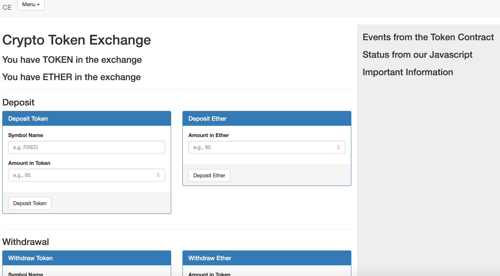

## Testing

`npm install`

`truffle compile`

`ganache-cli`

`truffle migrate --reset`

`npm run dev`

### Changes
- updated contracts to solidity 0.5.0
- updated Migrations.sol
- updated truffle-config.js

#### Notes
- https://ethereum.stackexchange.com/questions/30912/how-to-compare-strings-in-solidity

npm run build --> node_modules?
